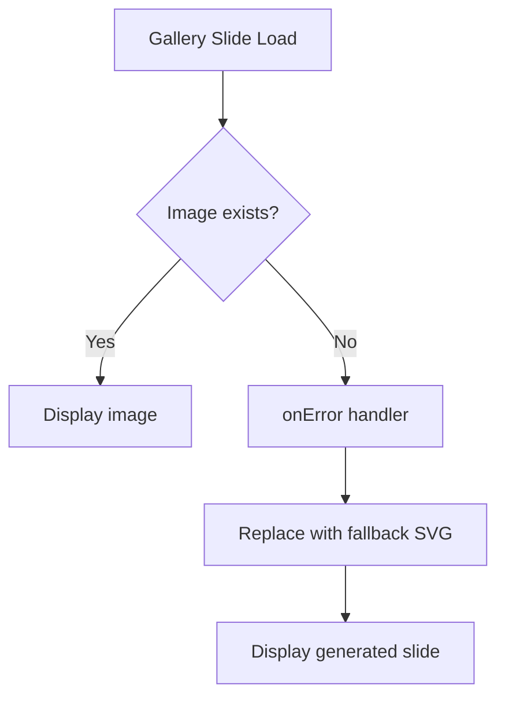
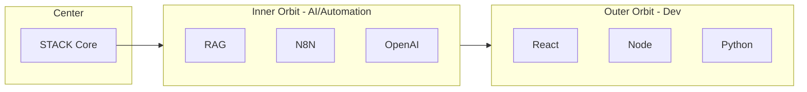
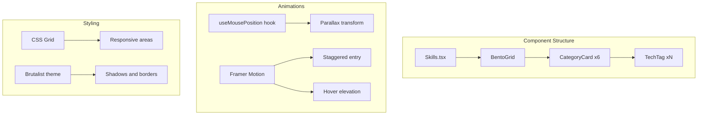

# Skills Section & Carousel Improvements Plan

## Overview

This plan addresses two main tasks:

1. **Creative improvement** for the Technology Stack section with brutalist + interactive style
2. **Bug fix** for the ProjectModal carousel where images are not loading correctly

---

## Part 1: Carousel Bug Analysis & Fix

### Problem Identified

After analyzing the codebase, I found **missing gallery images** for several projects:

| Project            | Gallery Path                    | Status                       |
| ------------------ | ------------------------------- | ---------------------------- |
| inverzy            | `/projects/inverzy/`            | ✅ Images exist              |
| kintsumind         | `/projects/kintsumind/`         | ❌ **Folder does not exist** |
| qhali              | `/projects/qhali/`              | ❌ **Folder does not exist** |
| alejandra-academia | `/projects/alejandra-academia/` | ✅ Images exist              |
| grown-home         | `/projects/grown-home/`         | ✅ Images exist              |
| decor-master-clean | `/projects/decor-master-clean/` | ✅ Images exist              |

### Root Cause

The projects [`kintsumind`](src/data/projects.ts:104) and [`qhali`](src/data/projects.ts:180) reference gallery images in their data but the actual image files don't exist in the `public/projects/` folder.

### Solution Options

**Option A: Add placeholder images**

- Create placeholder images for missing projects
- Ensures all projects have visual content

**Option B: Use fallback slides**

- The carousel already has a fallback mechanism via [`buildFallbackSlides()`](src/components/ProjectModal.tsx:51)
- Modify the logic to detect missing images and use generated SVG slides instead

**Option C: Remove gallery from projects without images**

- Clean up the data to only include gallery for projects with actual images

### Recommended Fix

Implement **Option B** with image error handling:



### Implementation Tasks

- [ ] Add `onError` handler to carousel images in [`ProjectModal.tsx`](src/components/ProjectModal.tsx:463)
- [ ] Create state to track failed images
- [ ] Replace failed images with brutalist SVG fallback
- [ ] Test carousel navigation with all projects

---

## Part 2: Creative Skills Section Proposals

### Current Implementation

The current [`Skills.tsx`](src/components/Skills.tsx) component features:

- Featured stage with 12 favorite tools as pills
- 6 category cards with tags
- Brutalist aesthetic with shadows, borders, stickers
- Hover animations on cards and pills

### Proposed Improvements

I present **3 creative concepts** that maintain the brutalist aesthetic while adding more visual interactivity:

---

### Concept 1: Orbital3D Stack

A 3D rotating orbital system where technology icons float and orbit around a central hub.



**Features:**

- CSS 3D transforms with `perspective` and `rotateX/Y`
- Technologies orbit on different radius levels
- Hover pauses animation and highlights tech
- Click opens tech detail card
- Maintains brutalist borders and shadows on cards

**Animation:**

- Continuous slow rotation
- Staggered entry animation on scroll
- Parallax depth effect on mouse move

---

### Concept 2: Floating Bento Grid

A modern bento-style grid with floating cards that respond to mouse movement.

```
┌─────────────────┬────────┬────────┐
│                 │  N8N   │  RAG   │
│   AI/ML Zone    ├────────┴────────┤
│   (Large)       │                 │
│                 │   Frontend      │
├────────┬────────│   Zone          │
│ Docker │  GCP   │                 │
├────────┼────────┼────────┬────────┤
│ NestJS │ Python │ React  │ Flutter│
└────────┴────────┴────────┴────────┘
```

**Features:**

- CSS Grid with `grid-template-areas` for layout
- Cards float with `translateZ` on hover
- Subtle parallax movement following cursor
- Brutalist shadows that shift with card position
- Staggered reveal animation on scroll

**Interactions:**

- Mouse move → cards tilt slightly toward cursor
- Hover → card elevates with enhanced shadow
- Click → expands card to show more technologies

---

### Concept 3: Terminal/Hacker Matrix

A terminal-style interface where technologies "decode" into view.

```
┌─────────────────────────────────────────────┐
│ > ./stack --render                          │
│                                             │
│ ████████████████████ 100%                   │
│                                             │
│ ┌──────────┐ ┌──────────┐ ┌──────────┐     │
│ │ > RAG    │ │ > N8N    │ │ > REACT  │     │
│ │ Systems  │ │ Flows    │ │ Frontend │     │
│ │ [####]   │ │ [####]   │ │ [####]   │     │
│ └──────────┘ └──────────┘ └──────────┘     │
│                                             │
│ > Status: 47 technologies loaded            │
│ > Categories: 6                             │
└─────────────────────────────────────────────┘
```

**Features:**

- Terminal window frame with scanlines effect
- Technologies appear with typing animation
- Matrix-style falling characters in background
- Glitch effect on hover
- Scanline overlay for retro feel

**Animations:**

- Staggered typing reveal
- Blinking cursor
- Random glitch effects
- Background matrix rain (subtle)

---

### Recommended Approach: Hybrid Floating Bento

I recommend a **hybrid approach** combining the best elements:

1. **Bento Grid Layout** - Modern, organized, responsive
2. **Floating Effect** - Cards elevate on hover with brutalist shadows
3. **Mouse Parallax** - Subtle depth movement
4. **Staggered Reveal** - Cards animate in sequence on scroll

### Implementation Details



### Technical Implementation

**New Components:**

- [`BentoCard.tsx`](src/components/atoms/BentoCard.tsx) - Reusable floating card
- [`useParallax.ts`](src/hooks/useParallax.ts) - Hook for mouse parallax effect

**Modified Files:**

- [`Skills.tsx`](src/components/Skills.tsx) - New bento layout
- [`global.css`](src/styles/global.css) - Bento-specific styles

**CSS Grid Template:**

```css
.skills-bento-grid {
  display: grid;
  grid-template-columns: repeat(4, 1fr);
  grid-template-rows: auto;
  gap: 16px;
}

.skills-bento-grid .category-ai {
  grid-column: span 2;
  grid-row: span 2;
}
.skills-bento-grid .category-frontend {
  grid-column: span 2;
}
.skills-bento-grid .category-backend {
  grid-column: span 2;
}
```

---

## Implementation Checklist

### Phase 1: Carousel Fix

- [ ] Add image error handling in ProjectModal
- [ ] Create fallback SVG generator for missing images
- [ ] Test all project modals

### Phase 2: Skills Section Redesign

- [ ] Create BentoCard component with floating effect
- [ ] Implement useParallax hook
- [ ] Update Skills.tsx with bento grid layout
- [ ] Add responsive CSS for mobile
- [ ] Add staggered entry animations
- [ ] Test accessibility and reduced motion

---

## Questions for User

Before proceeding with implementation, please confirm:

1. **Which Skills concept do you prefer?**
   - Orbital3D (more unique/flashy)
   - Floating Bento (modern/clean)
   - Terminal/Matrix (retro/hacker)
   - Hybrid approach

2. **For the carousel**, should I:
   - Add placeholder images for missing projects?
   - Use generated SVG fallbacks automatically?
   - Remove gallery from projects without images?

3. **Animation intensity:**
   - Subtle (professional)
   - Moderate (balanced)
   - Intense (eye-catching)
